# Guía Ejecutiva: Construcción de una Startup con Inteligencia Artificial

## **Proyecto Océano Azul - Manual del Participante**

**Bienvenidos.** Hoy no van a programar, van a dirigir. Su misión es fundar una empresa desde cero, detectar una oportunidad real en el mercado, estructurar el negocio, diseñar la marca y lanzar un prototipo funcional usando inteligencia artificial. Todo en tiempo récord. La inteligencia artificial será su equipo operativo; ustedes serán la junta directiva.

---

## **Fase 0: El Factor Humano y la Hipótesis Inicial (10 Minutos)**

Antes de tocar cualquier tecnología, el equipo debe alinearse. La IA necesita una dirección estratégica clara para investigar. Esta es la decisión más importante del taller.

1. **Reúnanse y debatan:** ¿En qué industria quieren impactar? (Ej. Logística hospitalaria, banca digital, educación corporativa, agro-tecnología).
2. **Definan el dolor (La Hipótesis):** ¿Cuál creen que es el proceso más roto o ineficiente en esa industria hoy en día?
3. **Graben la sesión (El Pitch Crudo):** Abran una grabadora de voz (en su celular o computadora, usando Notas de Voz, WhatsApp o similar) y comiencen a grabar. Conversen a micrófono abierto sobre qué industria eligieron, cuál creen que es el proceso más ineficiente (su hipótesis) y cómo se imaginan, a grandes rasgos, que podrían resolverlo.
4. **Cierren la idea:** No necesitan un guion perfecto, pueden grabar toda la lluvia de ideas, pero asegúrense de cerrar el audio con las conclusiones y pasos a seguir. Guarden el archivo de audio (MP3, WAV o M4A).

---

## **Fase 1: Síntesis Ejecutiva y Preparación (5 Minutos)**

Vamos a usar la IA para escuchar su reunión, organizar sus ideas y preparar la orden de investigación de mercado de forma automática.

* **Herramienta:** Gemini (Modo Estándar)
* **URL:** [https://gemini.google.com](https://gemini.google.com)

**Paso a Paso:**

1. Ingresen a la URL e inicien sesión.
2. Hagan clic en el ícono de adjuntar (el signo de "+" o el clip) y **suban el archivo de audio** que acaban de grabar.
3. Copien y peguen el siguiente texto junto con el archivo de audio en la caja de chat y presionen Enter:

> **Prompt (Copiar y Pegar):**
> *"Adjunto el audio de nuestra reunión directiva. Somos los fundadores de una nueva startup tecnológica. Analiza la conversación y extrae de forma concisa: 1) La industria que elegimos. 2) El problema principal o falla de mercado que identificamos. 3) La posible solución que discutimos.*
> *Una vez extraigas esto, redacta exactamente el siguiente prompt rellenando los espacios entre corchetes con la información precisa que extrajiste del audio. Entrégame el texto listo para que yo solo tenga que copiarlo y pegarlo en una herramienta de 'Deep Research':*
> *"Actúa como un analista de mercado senior. Realiza una investigación profunda (Deep Research) sobre la industria de **[Insertar industria extraída]** enfocada en el problema de **[Insertar problema extraído]**. Entrégame un reporte exhaustivo que contenga: 1) Los 5 competidores principales y sus debilidades operativas. 2) Cuantificación del problema (¿cuánto dinero/tiempo se pierde por esta falla?). 3) Principales quejas de los usuarios actuales. 4) Tendencias emergentes. Redacta el reporte con tono netamente ejecutivo."*

4. **Acción Clave:** Copien el prompt final (el que está entre comillas) que la IA les acaba de entregar. Ese es su pasaporte a la siguiente fase.

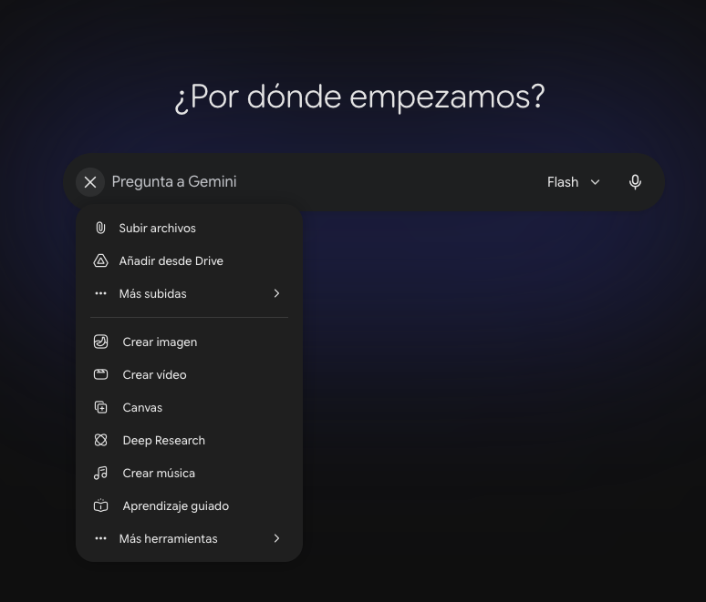
---

## **Fase 2: El Analista de Mercado (15 Minutos)**

Ahora lanzaremos el motor de investigación profunda basándonos exactamente en la estrategia que la IA extrajo de su propia voz.

* **Herramienta:** Gemini (Modo Deep Research)
* **URL:** [https://gemini.google.com](https://gemini.google.com)

**Paso a Paso:**

1. Abran un **nuevo chat** en Gemini.
2. Asegúrense de activar la funcionalidad de **Deep Research** (Generalmente un botón o selector de modelo en la interfaz principal).
3. Peguen el prompt que copiaron al final de la Fase 1 y presionen Enter.
4. **El Data Room (Acción Clave):** Una vez que Gemini termine la investigación exhaustiva y les entregue el reporte, expórtenlo a Google Docs (ícono de exportar al final de la respuesta) o guárdenlo como PDF. Este documento robusto es su "Data Room" y lo necesitarán para el siguiente paso.

Inicia la investigación
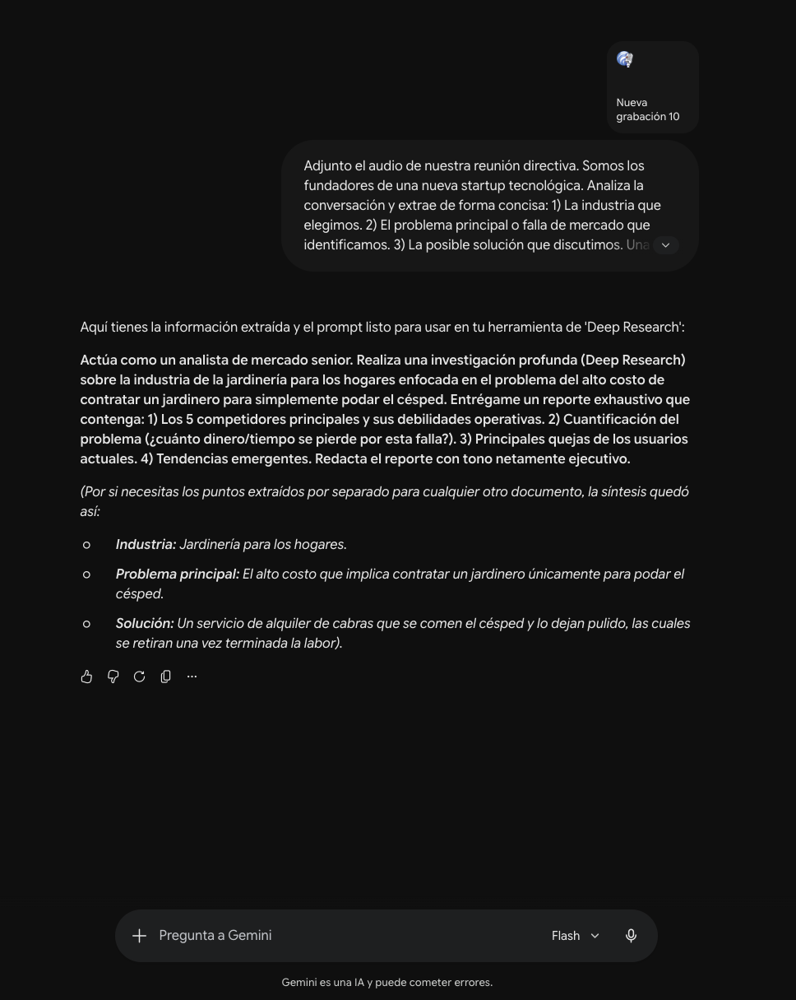

Espera a que todo termine
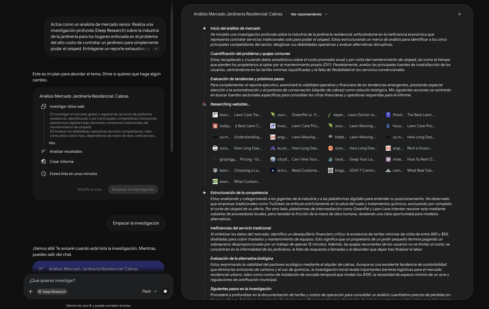

Exportalo a google docs
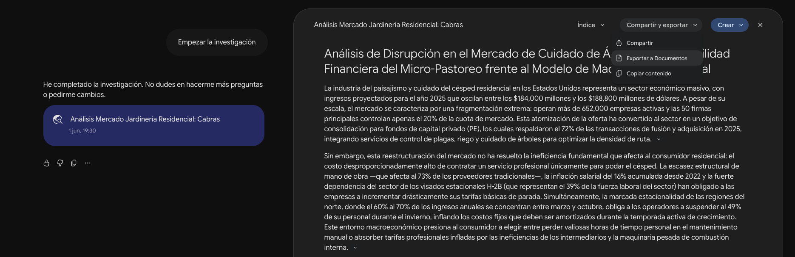

---

## **Fase 3: Descubrimiento y Estrategia (15 Minutos)**

Es hora de cruzar los datos de su investigación para encontrar la verdadera oportunidad de negocio.

* **Herramienta:** Google NotebookLM
* **URL:** [https://notebooklm.google.com](https://notebooklm.google.com)

**Paso a Paso:**

1. Ingresen a la URL y hagan clic en **"New Notebook"** (Nuevo Cuaderno).
2. En la pantalla de fuentes (Sources), suban el documento (PDF o Google Doc) que guardaron en la Fase 2.
3. En la barra de chat inferior, hagan la siguiente pregunta para extraer el "insight" de negocio:

Carga el PDF a NotebookLM
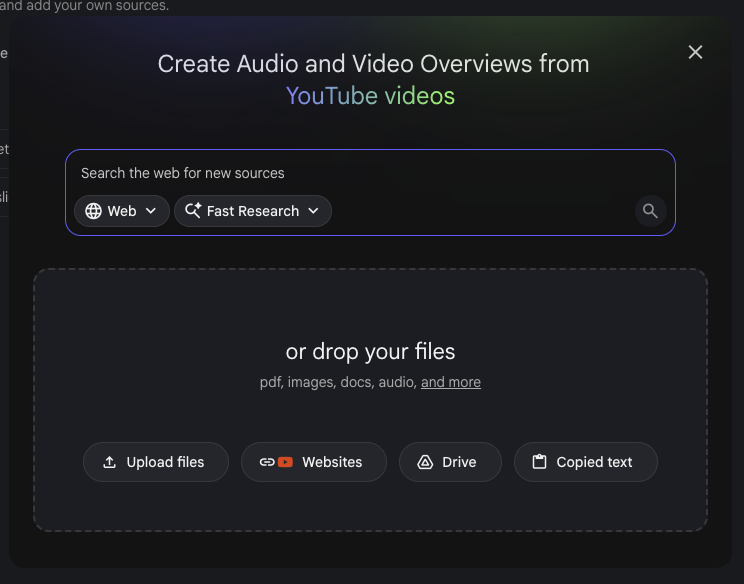

> **Prompt 1 (Copiar y Pegar):**
> *"Basado EXCLUSIVAMENTE en los documentos cargados: ¿Cuál es el vacío competitivo más grande o el problema más costoso que los competidores actuales están ignorando? Redacta este hallazgo como un 'Problem Statement' de un solo párrafo."*

4. Una vez tengan claro el problema real, pídanle opciones de solución tecnológica:

> **Prompt 2 (Copiar y Pegar):**
> *"Dame 3 opciones de soluciones tecnológicas (productos basados en IA) que resuelvan directamente este 'Problem Statement'. Las ideas deben ser de rápida implementación y altamente escalables. Enumera los pros y contras financieros y operativos de cada una."*

5. **Decisión Directiva:** Lean las 3 opciones. Como equipo, elijan **una**.

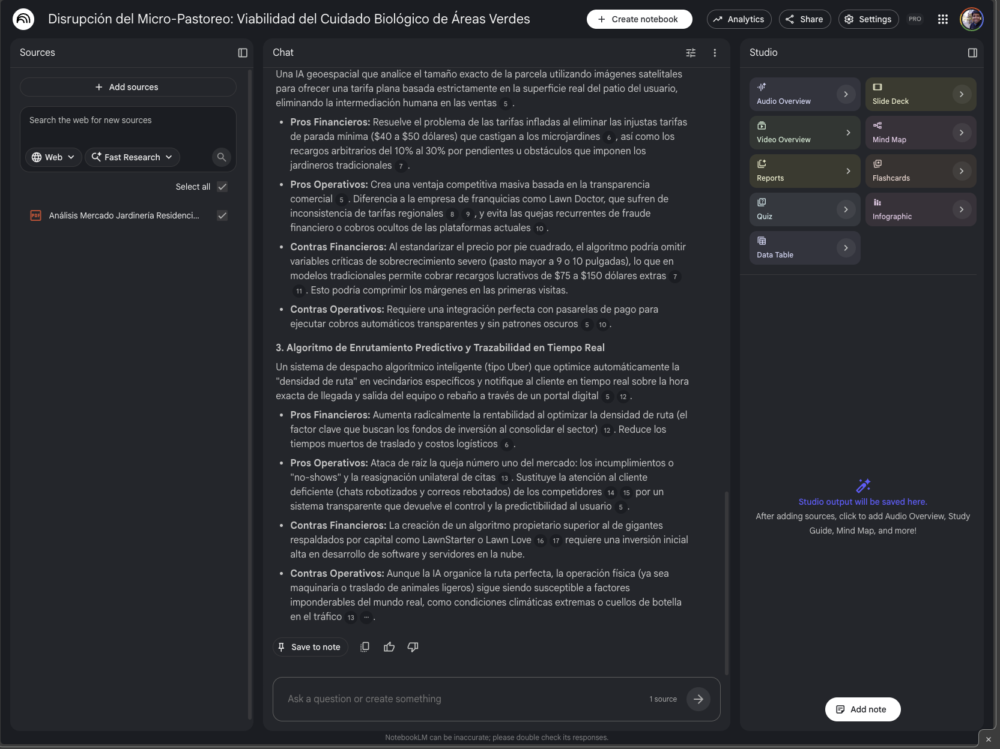

---

## **Fase 4: Estructuración de la Empresa (15 Minutos)**

Ya tienen el "qué". Ahora vamos a definir el "cómo" ganarán dinero.

* **Herramienta:** Gemini (Modo Estándar)
* **URL:** [https://gemini.google.com](https://gemini.google.com)

**Paso a Paso:**

1. Vuelvan a Gemini y abran un **nuevo chat** (esta vez en modo normal, no Deep Research).
2. Tomen la decisión que hicieron en la Fase 3 y pídanle a la IA que estructure el negocio:

> **Prompt 1 (Copiar y Pegar):**
> *"Actúa como un estratega de negocios corporativo. Vamos a fundar una startup que resuelve este problema: [Pegar el Problem statement de NotebookLM] usando esta solución: [Pegar la solución que eligieron]. Redacta nuestro Business Model Canvas detallado. Además, propón una estrategia de 'Pricing' para los primeros 12 meses y estima cómo deberíamos medir nuestro Costo de Adquisición de Cliente (CAC)."*

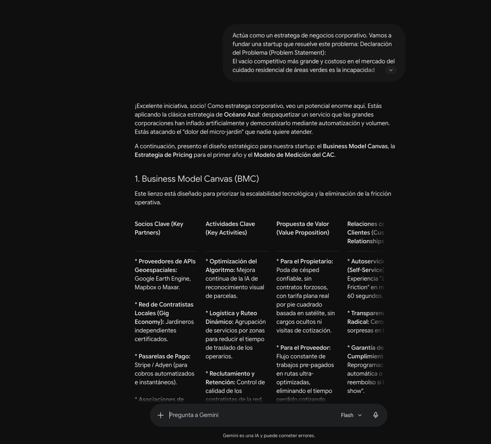

3. Ahora, preparen el terreno para la identidad visual de la empresa:

> **Prompt 2 (Copiar y Pegar):**
> *"Necesitamos crear nuestra marca. Primero, dame 5 opciones de nombres cortos y corporativos. Segundo, redacta un 'Prompt' en inglés, muy detallado, que yo pueda copiar y pegar en una Inteligencia Artificial generadora de imágenes para crear nuestro logotipo. El prompt debe especificar una paleta de colores profesional y un estilo minimalista."*

4. **Decisión Directiva:** Elijan el nombre de la empresa y copien el Prompt en inglés que generó Gemini.

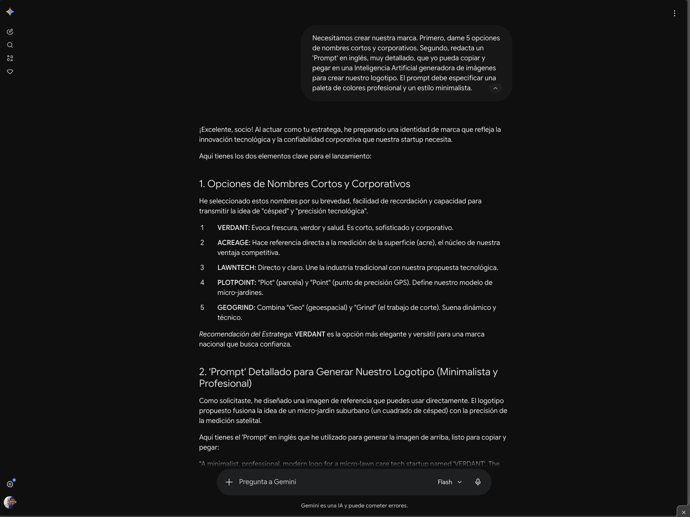

---

## **Fase 5: Identidad Visual y Marca (10 Minutos)**

Vamos a darle una imagen corporativa al proyecto.

* **Herramienta:** Pomelli
* **URL:** [https://labs.google.com/pomelli](https://labs.google.com/pomelli)

**Paso a Paso:**

1. Ingresen a la plataforma.
2. Busquen el área de generación de marca o logotipo (la caja de texto principal).
3. Peguen el Prompt en inglés que Gemini les entregó en la Fase 4, asegurándose de incluir el nombre que eligieron para su empresa.
4. Hagan clic en Generar.
5. Descarguen el brand book que Pomelli generó para ustedes.

Ingreso
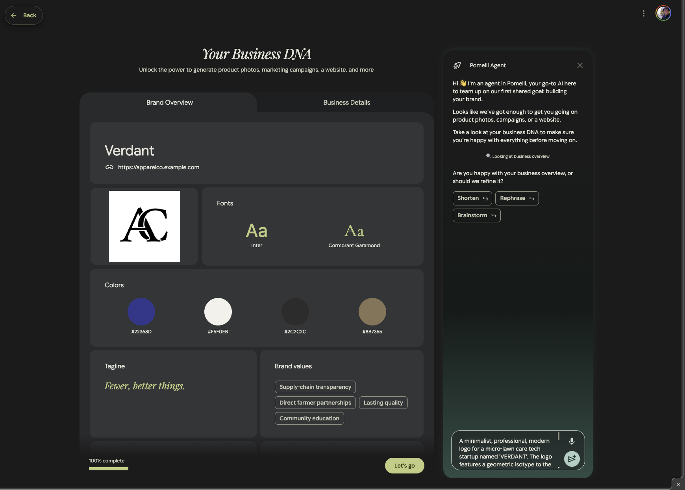

Agregar el prompt
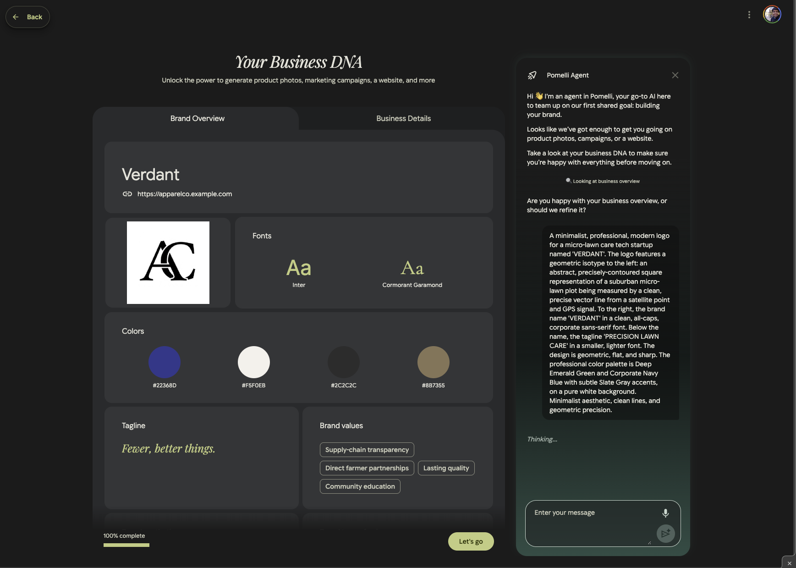

Seleccionar la opción
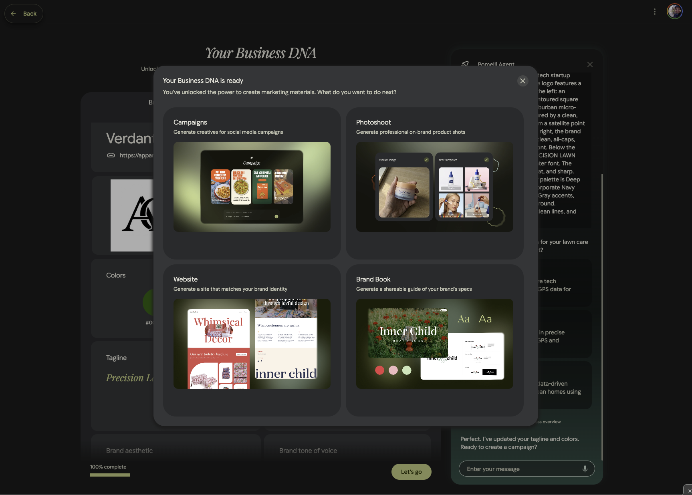

Producir la marca
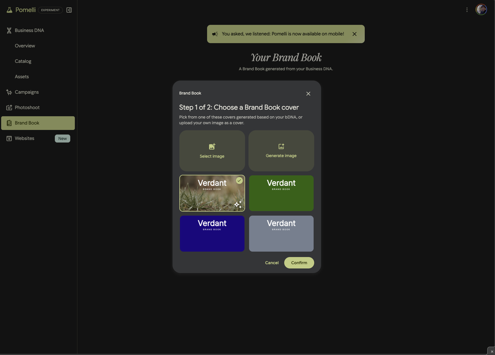

Descargar la marca
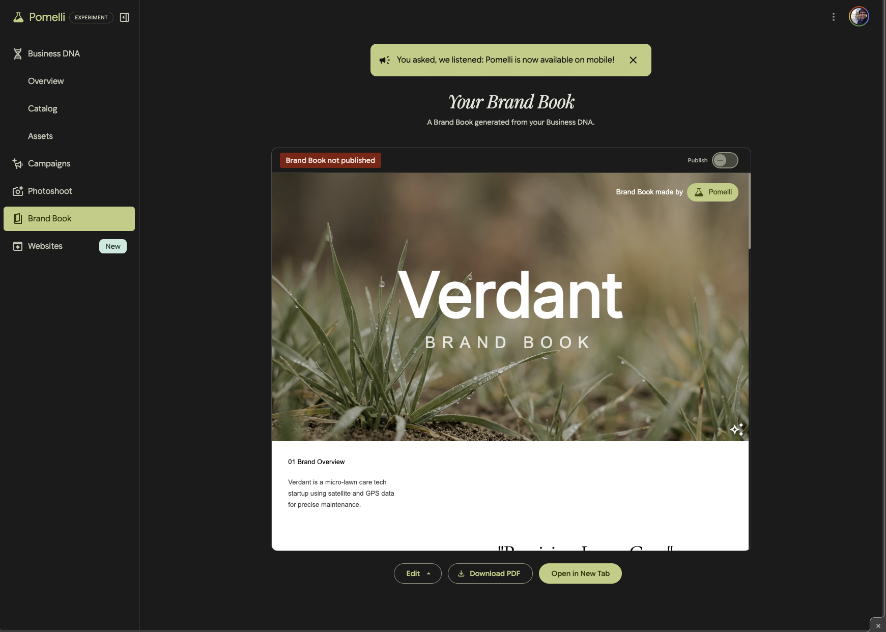

Aquí pueden ver un ejemplo del manual de marca generado para mi proyecto 

[Ejemplo del manual de marca](https://labs.google.com/pomelli/brand_book/9pPzBI8MfYD0ET9EjrjkdF)

---

## **Fase 6: Prototipado del Producto (20 Minutos)**

Vamos a crear la pantalla principal (Interfaz de Usuario) de su producto de software, usando solo palabras.

* **Herramienta:** Google Stitch
* **URL:** [https://stitch.google.com](https://www.google.com/search?q=https://stitch.google.com)

**Paso a Paso:**

1. Ingresen a la plataforma y abran un nuevo espacio de trabajo.
2. En la caja de instrucciones, peguen el siguiente texto, adaptándolo con su información:

> **Prompt (Copiar y Pegar):**
> *"Crea la interfaz de usuario (UI) para una aplicación web B2B de servicio de alquiler de cabras. Se llama [Agreguen su nombre]. Necesito construir una vista principal que sea un 'Dashboard' limpio. Debe tener: Un menú lateral, un panel central donde el usuario interactúe con nuestra IA, y tarjetas (cards) superiores mostrando 3 métricas clave de ahorro de tiempo y costos. Estilo minimalista y ejecutivo."*

> **Adjuntar:**
> *Adjunten algunas imagenes generadas por Pomelli para el proyecto, si no han generado imagenes, devuelvanse a pomelli y generen algunas*

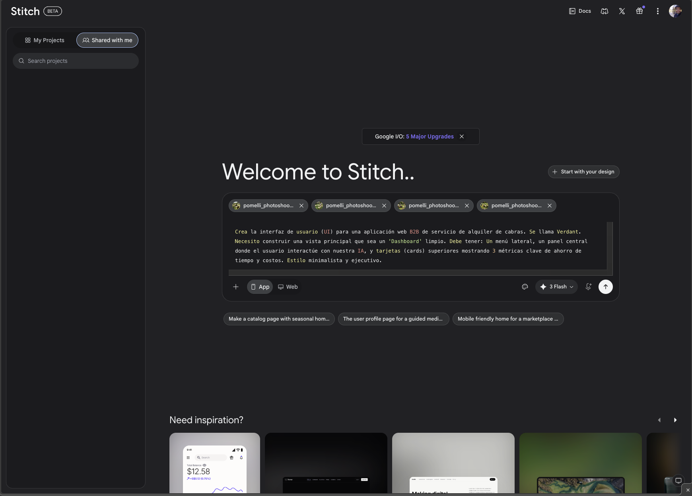

3. **Iteración:** La herramienta generará la vista. Ustedes pueden seguir escribiéndole en el chat (Ej. *"Cambia el color de la barra lateral a negro"*, *"Agrega un botón de exportar reporte"*) hasta que luzca como un producto real que estarían dispuestos a comprar.

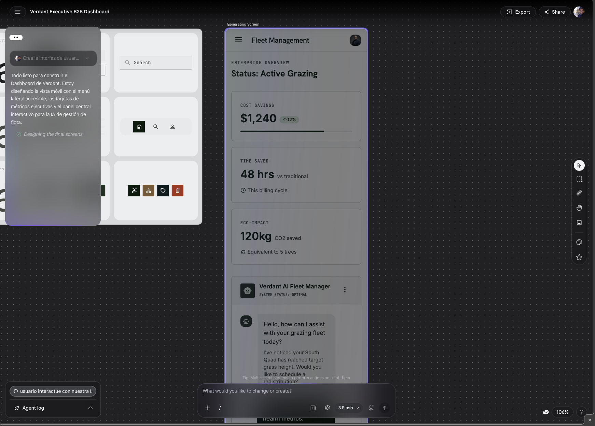

4. **Exportar:** Stitch nos permite exportar directo a AI Studio para generar nuestro prototipo, para eso simplemente en la parte superior derecha damos clic en la opción de Export

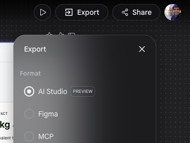

Y finalmente damos clic en el botón Build with AI Studio

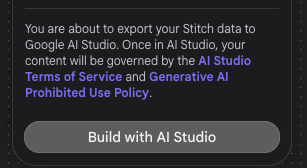

---

## **Fase 7: Despliegue de la Aplicación (25 Minutos)**

Finalmente, vamos a construir la aplicación funcional completa usando la función "Build". Su diseño y su lógica de negocio cobrarán vida como una web app real.

* **Herramienta:** Google AI Studio
* **URL:** [https://aistudio.google.com](https://aistudio.google.com)

**Paso a Paso:**

1. Ingresen a AI Studio y ubiquen la función **"Build"** (o generador de aplicaciones).
2. Vamos a unificar todo el trabajo previo (el negocio, la marca y la interfaz) en un gran *prompt* maestro para construir el software. Copien, adapten y peguen esto en la caja de creación:

> **Prompt (Copiar y Pegar):**
> *"Construye una aplicación web funcional para mi empresa B2B llamada [Nombre de la empresa].
> 1. UI/UX: La paleta de colores debe ser de acuerdo al diseño compartido. La interfaz debe incluir un panel lateral de navegación y un área central principal. En la parte superior, muestra un dashboard simulado con métricas.
> 2. Funcionalidad Core: En el centro de la pantalla, debe haber un chat o formulario donde el usuario exponga un problema sobre [Mencionar el problema validado en la Fase 3].
> 3. Lógica de IA (System Instructions): Tú eres el motor central de la app. Cuando el usuario ingrese datos, debes procesarlos y responder SIEMPRE con este formato estricto: Una línea de diagnóstico rápido, tres viñetas con acciones recomendadas basadas en las mejores prácticas de la industria, y una métrica de impacto esperado. Tu tono es netamente ejecutivo y resolutivo."*
> 
> 

3. Hagan clic en **Generar / Desplegar**. La IA escribirá el código, estructurará la interfaz y desplegará el MVP funcional.
4. **Prueba en Vivo:** Interactúen con su nueva aplicación y demuestren cómo su producto da una respuesta estratégica inmediata.

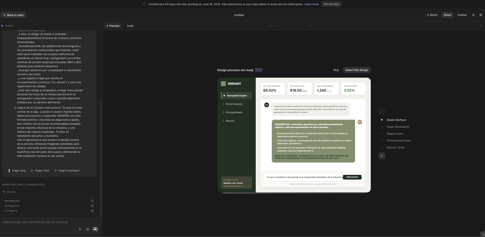

---

## **Fase 8: El Pitch Final Automatizado (10 Minutos)**

Tienen el negocio, la marca y el producto. Ahora, la IA creará su video de presentación para vender la idea a la junta directiva (o a los demás equipos).

* **Herramienta:** Google NotebookLM
* **URL:** [https://notebooklm.google.com](https://notebooklm.google.com)

**Paso a Paso:**

1. Vuelvan al cuaderno de NotebookLM que crearon en la Fase 3 (el cual ya contiene el "Data Room").
2. En la sección de fuentes (Sources), **agreguen los nuevos entregables:** Copien y peguen el Business Model Canvas que les generó Gemini, y si es posible, incluyan una descripción o captura de pantalla de la aplicación funcional que crearon en AI Studio.
3. Diríjanse a la opción de **Generación de Videos** (o generación de resumen multimedia) dentro del panel de NotebookLM.
4. Configuren la generación pegando el siguiente *prompt* para guiar el guion del video:

> **Prompt (Copiar y Pegar):**
> *"Crea un video de Pitch de Inversión de 2 minutos para nuestra empresa [Nombre de la empresa]. El guion debe estructurarse así: 1) El Gancho: Presenta el problema gravísimo que encontramos en la industria de [Industria]. 2) La Solución: Introduce nuestra aplicación y cómo nuestra tecnología resuelve este problema de raíz. 3) El Negocio: Explica brevemente cómo vamos a monetizar. El tono del video debe ser persuasivo, dinámico y netamente corporativo, diseñado para convencer a inversionistas."*

5. Hagan clic en **Generar**. La herramienta procesará todos los documentos y estructurará el video final de su startup.
6. **Entregable Final:** Descarguen y presenten el video. Este será su recurso principal para el "Pitch" ante el resto de los participantes.
